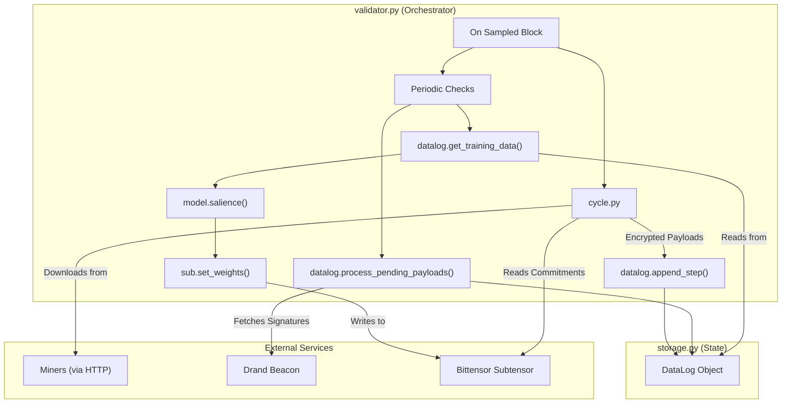

# MANTIS

## Purpose

Incentivize the production of any information that has predictive power for the next 1-hour returns of a diverse basket of financial assets, including cryptocurrencies and forex pairs.

The validator's core responsibilities are to:

1.  **Collect** encrypted data payloads from all active miners at regular intervals.
2.  **Securely Decrypt** the payloads using time-lock encryption (`tlock`) and verify the embedded hotkey of the submitting miner.
3.  **Calculate Salience** by training a predictive model and using permutation importance to measure the marginal value of each miner's data.
4.  **Set Weights** on the Bittensor blockchain, rewarding miners in proportion to the salience of their historical contributions.

---

## Minimal Architecture Diagram



## Core Modules

1.  **`config.py`** – A single source of truth for tunable constants like `NETUID`, the list of `ASSETS`, their `ASSET_EMBEDDING_DIMS`, and the `LAG` for return calculations.
2.  **`validator.py`** – The top-level orchestrator. It runs an infinite loop that is driven by the blockchain's block height, orchestrating all data collection, processing, and weight-setting tasks at their specified intervals.
3.  **`storage.py`** – The heart of the system. It contains the `DataLog` class, which manages all historical state, including multi-asset prices, decrypted embeddings, and the queue of raw encrypted payloads. It is responsible for data integrity, persistence, and the entire `tlock` decryption and hotkey verification workflow.
4.  **`cycle.py`** – A stateless utility responsible for fetching the current set of miner commitments from the subtensor and downloading their corresponding raw payloads via HTTP.
5.  **`model.py`** – An XGBoost-based model used to compute per-miner salience via permutation importance, a robust method for evaluating feature value.
6.  **`comms.py`** – Handles all asynchronous network download operations and local caching.

---

## Data Structure

The validator's entire state is encapsulated within the `DataLog` object, defined in `storage.py`. This makes the system portable and easy to manage.

```python
class DataLog:
    # Timestamps and multi-asset reference prices
    blocks:         List[int]
    asset_prices:   List[Dict[str, float]]
    
    # Decrypted, model-ready multi-asset data
    plaintext_cache: List[Dict[int, Dict[str, List[float]]]]
    
    # Queue of unprocessed encrypted payloads
    raw_payloads:   Dict[int, Dict[int, dict]]

    # For tracking miner ownership and wiping history on hotkey changes
    uid_owner:      Dict[int, str]
```

---

## End-to-End Workflow

1.  **Initialisation** – On startup, `validator.py` initializes a `DataLog` object. By default, it attempts to bootstrap its state by downloading an archive from the public URL in `config.py`. The `--no_download_datalog` flag can be used to start with a fresh, empty log.
2.  **Collection (every `SAMPLE_STEP` blocks)** – `validator.py` calls `cycle.py` to fetch all miner payloads and appends the new encrypted data and current asset prices to the `DataLog`.
3.  **Metagraph & Miner Sync (every 100 blocks)** – The validator syncs the Bittensor metagraph and immediately calls `datalog.sync_miners()` to handle any UID-hotkey changes, wiping the history for any UID that has changed ownership.
4.  **Decryption (runs continuously)** – A background loop in `validator.py` constantly calls `datalog.process_pending_payloads()`. This finds all payloads that are now old enough to be unlocked, fetches the required Drand signatures, decrypts them, and verifies the embedded hotkeys.
5.  **Evaluation (every `TASK_INTERVAL` blocks)** – A background thread calls `datalog.get_training_data()` to get the latest model-ready data, computes salience scores using the XGBoost model, normalizes them, and submits the new weights to the subtensor.

---

## Security Highlights

-   **Time-lock Encryption:** Uses `tlock` and the public Drand randomness beacon to prevent miners from submitting predictions after observing the future price.
-   **Embedded Hotkey Verification:** The plaintext of every payload must contain the miner's hotkey (`embeddings:::hotkey`). During decryption, the validator verifies that this embedded hotkey matches the one registered in the metagraph for that UID, preventing payload spoofing.
-   **Commit Validation:** The validator verifies that the filename in a miner's commit URL matches their hotkey, preventing one miner from pointing to another's data.
-   **Data Validation:** All decrypted payloads are strictly validated. Any data that is malformed (wrong structure, values out of range) is safely discarded and replaced with a neutral zero vector.
-   **Payload Size Limits:** `comms.py` enforces a maximum download size to mitigate denial-of-service attacks.
-   **Stagnant Price Filtering:** The system automatically identifies and nullifies periods where an asset's price has not changed, ensuring the model is not trained on stale or corrupt data.

---

## Dependencies

The system's core dependencies are managed in `requirements.txt`. Key libraries include:
-   `bittensor`
-   `xgboost`
-   `timelock`
-   `requests`, `aiohttp`

---

## Extensibility

-   Swap in an alternative salience algorithm by editing **`model.py`** only.
-   Change the data storage and processing logic by editing **`storage.py`**.
-   Modify the list of tracked assets or their embedding dimensions in `config.py`.

---

## License

Released under the MIT License © 2024 MANTIS. 
